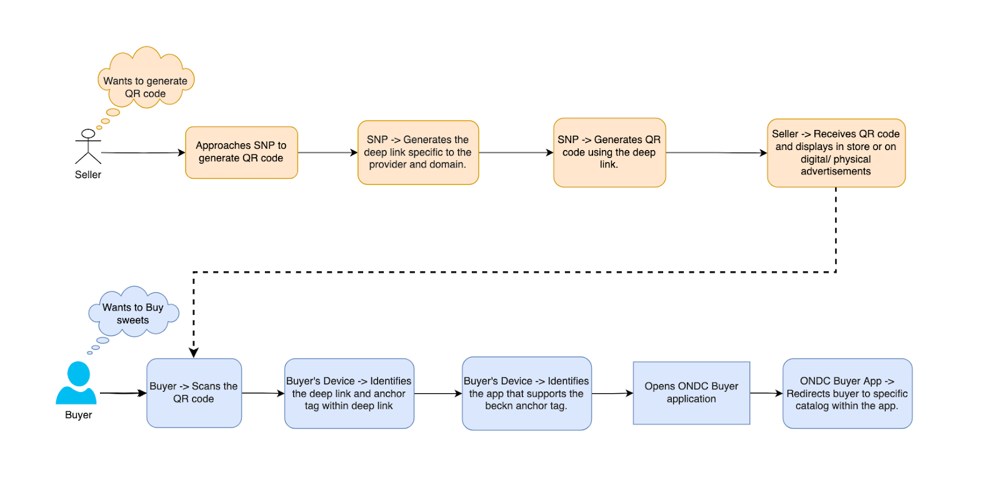

# Enabling deeplink encoded QR codes

## Objective
Beckn is fast catching up as a viable protocol for many transactional oriented systems. While beckn abstracts much of transactional complexities by standardizing specifications and protocol imperatives, it is pertinent that beckn gets identified as an established URI scheme, in line with what UPI has done for major platforms (HTML, Android, iOS etc.). A similar tag is available in whatsapp as well. Following are few examples:
```
upi://pay?pa=upiaddress@okhdfcbank&pn=JohnDoe&cu=INR
whatsapp://send?abid=phonenumber&text=Hello%2C%20World!
```

## Problem
One of the immediate use cases for this purpose is enabling QR code for merchant shops. Today, the QR codes are either very localized to merchants or have a platform centric approach, where the embedded QR code can only direct to a specific app. There is a need for unbundling this and creating a deep link enabled through anchor tags like that of in upi, that will enable the discovery of stores irrespective of the BPP they are associated with. Each BAP shall need to respect a standard anchor tag identified through a beckn compliant application and make the catalog for store visible on device. The anchor tag will also ensure that specific SDKs/Libraries will have an identification of beckn as protocol which developers can use to activate boilerplate codes.

## Proposed Solution
ONDC proposes to introduce beckn as an identified URI scheme and established protocol within developer community and platforms such as openJDK, Android, iOS etc.  As the first use case, ONDC proposes to enable QR code features for merchants facilitated by their respective BPPs (Seller Apps in this context).



Creating a QR code with data drafted in a deep link enabled through anchor tags of beckn in line of what UPI/ WhatsApp/XMPP have enabled, will enable the discovery of stores and their catalog on the buyer app of their choice. Consumers shall scan such QR stores visibly available on stores onboarded on ONDC through a seller app and will be offered for displaying in the store. 
 
The deep link may look like: 
```
beckn://ondc?context.bpp_id=biz.enstore.combiz.enstore.com&message.intent.provider.id=p1234&context.domain=ONDC:RET10&context.action=search
```

### QR code generation 
BPPs would facilitate the sellers to generate the QR codes specific to the provider. ONDC offers an open-source [utility](https://github.com/ONDC-Official/reference-implementations/tree/main/utilities/deep-links) designed to produce QR codes embedded with merchant-specific information. However, seller Apps may decide to provide their own feature and technology sets to generate standard QR codes with appropriate density for each scanning of the code.

### URI Scheme Recognition
Each BAP application that are beckn enabled would need to add `beckn` as the supported URI scheme. When the QR code with deep link - `beckn://ondc?....` is scanned, the system checks for installed applications which can handle the `beckn://` scheme.

### Platform Integrations
Different platforms have different handling mechanisms, for example, Android uses Intent Filters and iOS uses URL schemes or Universal links to identify which apps can handle which URI schemes or use fallback URLs to redirect the consumer to a fallback web URL, usually prompting them to download the relevant app. If multiple apps have registered the same URI scheme, it will either redirect to the default app or prompt the user to select the app they would like to use. Please refer to the android specific changes [here](https://github.com/ONDC-Official/reference-implementations/tree/main/utilities/deep-links/android) and a [detailed guide](https://docs.google.com/document/d/1pmwQvF9G37_KwcFViub7m_qYDUjbGLrwvgkv1XZEc08/edit) on implementation.


### Interpreting Deep Link
The interpretation of a beckn deep link depends on the specific parameters and values included in the deep link URL. Beckn deep links are designed to convey specific instructions or information to Beckn enabled applications (Buyer Application Platforms or BAPs). Here's a general guide on how a beckn deep link is typically interpreted:

**Beckn Deep Link Structure:**
`beckn://<network>?context.bpp_id=<BPP_ID>&message.intent.provider.id=<provider_ID>&context.domain=<domain>&context.action=<search>`

1. **Scheme** (`beckn://`):
    - The custom URI scheme that indicates the deep link is specifically for beckn enabled apps or services.
2. Network (`ondc`):
    - The `<network>` component in the deep link identifies the specific network to which the request belongs to. For example, here it indicates the ONDC (Open Network for Digital Commerce) network. The BAPs would need to maintain a local lookup table to identify the registry endpoint based on the network.
3. Query Parameters:
    - The query parameters are key-value pairs included in the deep link, and they convey specific information for BAP to consume and redirect the user accordingly. All the query parameters are optional.


### Use Cases:
Deep linking with the beckn URI scheme can open the door to a wide range of use cases, each designed to enhance user interaction, convenience, and efficiency across different domains within the ONDC network. While the possibilities are vast, we've cataloged a few illustrative use cases to showcase the potential of this technology.

#### 1. Catalog Access through Seller-Generated QR Codes
Imagine a buyer walking into a store and having the power to view the complete merchant's catalog using their smartphone. By scanning a QR code generated by the seller (facilitated by BPP), customers can have instant access to the entire inventory, enhancing the shopping experience while making it more efficient.

Deep Link Structure:
`beckn://ondc?context.bpp_id=sellerapp.com&message.intent.provider.id=P1&context.domain=ONDC:RET10&context.action=search`

When a buyer scans the QR code, the system (buyer’s mobile device) looks for applications that support beckn URI scheme. Once a buyer chooses one specific buyer application (BAP) from the list of applications supported by beckn, the BAP identifies the network as ONDC and based on the parameters, BAP identifies the action as search, which is the discovery phase and redirects the buyer to the catalog for `sellerapp.com`.P1 for Grocery (ONDC:RET10) domain from cache. 

The deep link might also look like:
`beckn://ondc?context.bpp_id=sellerapp.com&message.intent.provider.id=P1&context.domain=ONDC:RET10`

Here default action being search (context.action = search), the buyer will be able to explore the complete catalog irrespective of domains for the specific provider P1 onboarded on bpp - sellerapp.com.

#### 2. Category-Specific Browsing via Seller-Generated QR Codes
The seller might want to create QR codes for each category of products, for example `Foodgrains` in Grocery, which will guide customers to a specific product category, streamlining their search.
Deep Link Structure:

`beckn://ondc?context.bpp_id=sellerapp.com&message.intent.provider.id=P1&message.intent.provider.locations.0.id=L1&context.domain=ONDC:RET10&context.action=search&message.intent.category.id=Foodgrains`
